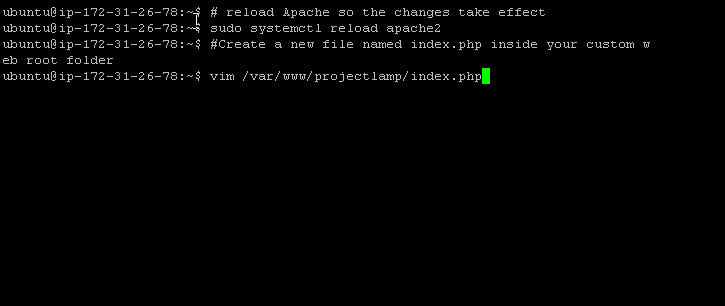

# LAMP STACK IMPLEMENTATION PROJECT DOCUMENTATION

**LAMP**
: Is a Web technology stack who's  frameworks and tools are very specifically chosen to work together in creating a well-functioning software.

## **LAMP** is an acronymn for individual technologies (Linux, Apache, MySQL, PHP or Python, or Perl

* *Project steps*

1. installing apache and updating the firewall
2. installing mysql
3. installing php
4. creating a virtual host for your website using apache
5. enable php on the website

## **1.** *Installing apache and updating the firewall*

>`sudo apt update`

>`sudo apt install apache2`

>`sudo systemctl status apache2`

>`curl http://localhost:80`
*#To access sever locally on the ubuntu shell.*

>*#use server public IP/DNS to access server on the web.*

## **2.** *Installing mysql*

>`sudo apt install mysql`

>`sudo mysql`
>*#to connect to mysql as the administrative database root user*

>`ALTER USER 'root'@'localhost' IDENTIFIED WITH mysql_native_password BY 'PassWord.1';`
>*#To secure and set a password on mysql*

>`sudo mysql_secure_installtion`
>#*To start mysql interactive script*

>#*type Y(yes) to all required settings*

>`sudo mysql -p`
>*#To login to mysql using password*

`exit` *#To exit mysql console*

>`sudo apt install php libapache2-mod-php-mysql`
*To install php libapache2-mod-php-mysql packages all at once*

>*#installation successfull*

>`php -v` #*To confirm php version*

## **4.** *creating a virtual host for your website using apache*

>`sudo mkdir /var/www/projectlamp`  
`sudo chown -R $USER:$USER ?var/www/projectlamp`  
`sudo vi /etc/apache2/sites-available/projectlamp.conf`

>`sudo vi /etc/apache2/sites-available/projectlamp.conf`

>`sudo ls /etc/apache2/sites-available`  
`sudo a2ensite projectlamp`

>`sudo a2dissite 000-default`

`sudo apache2ctl configtest`

`sudo systemctl reload apache2`

>`sudo echo 'HELLO LAMP from hostname' $|curl -s http://169.254.169.254/latest/meta-data/public-hostname) 'with public ip' $(curl -s htp:/169.254.169.254/latest/meta-data/public-ipv4) > /var/www/projectlamp/index.html`

>*# Access the HTML page on the web, using the server public ip/DNS*

## **5.** *enable php on the website*

>`sudo vim/etc/apache2/mods-enabled/dir.conf`

>*# old file arrangement*

>*# new file arrangement*

>`sudo systemctl reload apache2` *#reload apache so the changes take effect*

`vim /var/www/projectlamp/index.php` *#create a new file named index.php inside your custome web root folder*

>*#php file, to display php info*

>*#access php info web view using public IP/DNS*

>`sudo rm /var/www/projectlamp/index.php`

>*#after checking the relevant information about your PHP server through the above page, it's best to remove the file you created as it contains sensitive information about your PHP environment and your ubuntu server*

